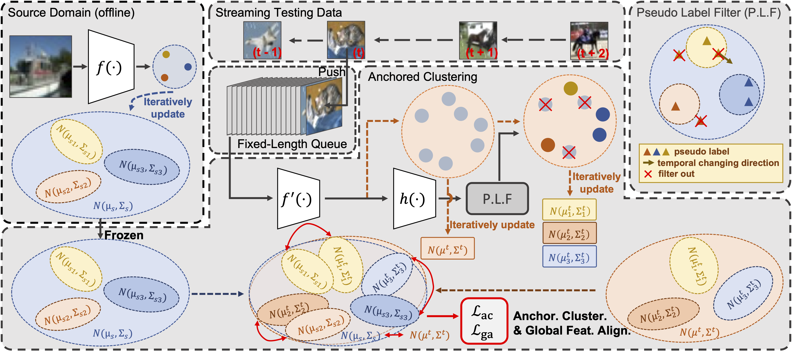

# TTAC

This repository is an official implementation for our NeurIPS 2022 paper [\[Arxiv\]](https://arxiv.org/abs/2206.02721).

## Revisiting Realistic Test-Time Training: Sequential Inference and Adaptation by Anchored Clustering

**Yongyi Su<sup>1\*</sup>** &nbsp; **Xun Xu<sup>21\*&#8224;</sup>** &nbsp; **Kui Jia<sup>13&#8224;</sup>**
<br>
<sup>1</sup>South China University of Technology &nbsp; <sup>2</sup>Institute for Infocomm Research &nbsp; <sup>3</sup>Peng Cheng Laboratory
<br>
<sup>*</sup>Equal contribution &nbsp; <sup>&#8224;</sup>Correspondence to <kuijia@scut.edu.cn> & <alex.xun.xu@gmail.com>


### Overview




### CIFAR10/100

The code is released in the [cifar](cifar) folder.

### ImageNet-C

The code is released in the [imagenet](imagenet) folder.

### Citation

If you find our work useful in your research, please consider citing:

```bibtex
@inproceedings{
  su2022revisiting,
  title={Revisiting Realistic Test-Time Training: Sequential Inference and Adaptation by Anchored Clustering},
  author={Yongyi Su and Xun Xu and Kui Jia},
  booktitle={Thirty-Sixth Conference on Neural Information Processing Systems},
  year={2022}
}
```
